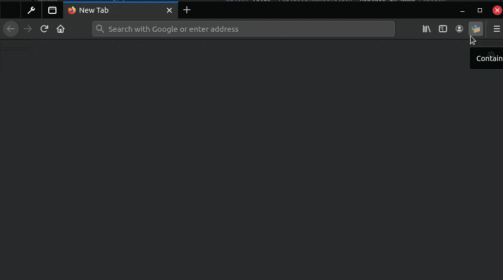
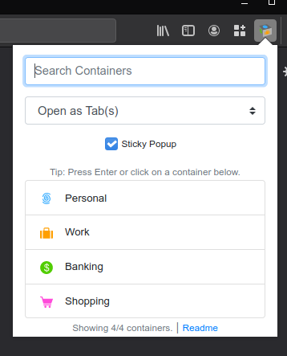
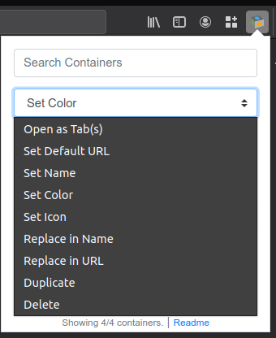
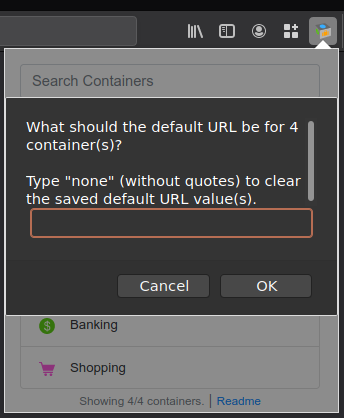
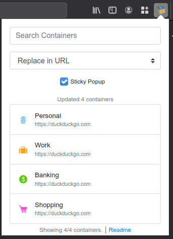
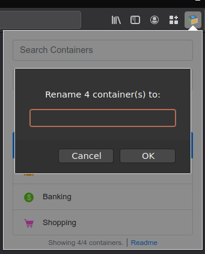
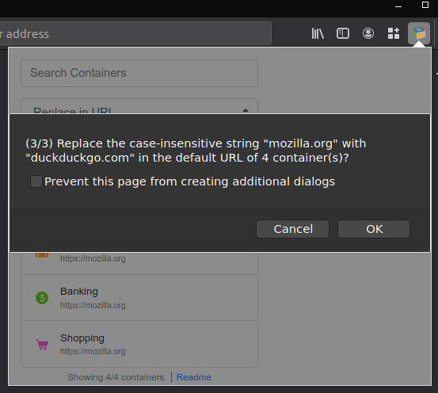

# Firefox Containers Helper


Firefox multi-account containers are for power users. So is this extension. This extension adds bulk container interactivity features missing from the Mozilla Multi-Account Containers extension.

This extension is intended to *augment* the Multi-Account Containers extension in Firefox.

This readme contains extensive information about the extension and it aims to bootstrap new users into using the extension effectively.

## Repository source code update

This repository is now going to be hosted and managed on GitHub here: https://github.com/charles-m-knox/firefox-containers-helper

This repository will be archived.

## Table of Contents

- [Firefox Containers Helper](#firefox-containers-helper)
  - [Table of Contents](#table-of-contents)
  - [Who is this intended for?](#who-is-this-intended-for)
  - [Features](#features)
  - [Examples and Screenshots](#examples-and-screenshots)
    - [v0.0.10 Examples](#v0010-examples)
      - [v0.0.10 Live Example](#v0010-live-example)
      - [v0.0.10 Screenshots](#v0010-screenshots)
    - [v0.0.3 Examples](#v003-examples)
      - [v0.0.3 Live example](#v003-live-example)
      - [v0.0.3 Screenshots](#v003-screenshots)
    - [v0.0.2 Examples](#v002-examples)
      - [v0.0.2 Basic example (short example)](#v002-basic-example-short-example)
      - [v0.0.2 Longer example](#v002-longer-example)
      - [v0.0.2 Setting multiple URLs simultaneously](#v002-setting-multiple-urls-simultaneously)
      - [v0.0.2 Opening multiple URLs simultaneously](#v002-opening-multiple-urls-simultaneously)
      - [v0.0.2 Bulk deletion of containers](#v002-bulk-deletion-of-containers)
  - [Tips](#tips)
    - [Container naming convention suggestions](#container-naming-convention-suggestions)
  - [FAQ](#faq)
  - [Warnings](#warnings)
  - [Future Features](#future-features)
  - [Community](#community)
  - [Attributions](#attributions)

## Who is this intended for?

If you're like me and you care deeply about your web browsing privacy, you may be creating a large amount of containers for your browsing, even multiple containers for the same sites.

If this is you, and if you've also struggled to scroll through your long list of containers without reprieve or do other bulk interactions with the multi-account containers extension, then this extension is for you. It will enable you to quickly filter all of your containers and open a new one quickly, or do other things (continue reading).

## Features

* **Container search capability** - filters your containers as you type.
  * Press `enter` to open the first result in the list (or the only result, if just one result remains).
  * Simultaneously press `ctrl` and either `click` or `enter` to open the result(s) in a pinned state.
  * Combine above shortcuts with `shift` to open all filtered containers at once.
* **Set a Default URL for containers** - Any time you use this extension to open a tab, you can configure the tab to open a specific URL by default.
  * The URL settings are stored as part of the extension itself, and are independent of the Multi-Account Containers addon. It will not affect any existing settings, and will not change the behavior of which URLs are opened in which containers by default.
  * Similar to above, press `shift` to bulk-set-default URLs for the current query.
* **Sticky Popup** - If you want, you can check this box to keep the extension open while you click on different results (to open many containers) for your search. This mode feels very powerful to use.
* **Set Name/Icon/Color mode** - Allows you to quickly set one or more containers' icon, color, or name quickly.
* **Find and Replace mode** - Allows you to perform a find and replace on container names or default URLs.
* **Duplication mode** - Allows you to duplicate one or more containers returned by a search query.
  * Note: Duplication mode currently does not copy the default open-in-URL capability for multi-account containers, but it does duplicate default URLs defined for containers within this extension. (This extension currently does not have the capability to access information about default open-in-URLs for containers, which is stored in the extension settings for the multi-account containers extension storage in your browser's settings)
* **Deletion mode** - When checked, you can click on a container to delete it. This method of deletion is a bit quicker than the multi-account containers extension. You will be prompted for deletion more than once.
  * **Caution: This can delete all of your containers if you're not careful.**
  * Similar to above, press `shift` to bulk-delete containers returned by a query.
* **Keyboard shortcut** to open the popup window is `alt+shift+D`. It will immediately focus the search box, so you can quickly filter for a container, press enter, and go.

## Examples and Screenshots

This section contains some recordings and walkthroughs of use cases for this extension. Hopefully, it helps clarify ways to leverage this extension as best as possible for readers.

If any of this is confusing, remember the basics:

* Press `shift` and click/enter to act on ALL results (bulk open tab/delete container/set URL action)
* Press `ctrl` and click/enter a result to open as pinned tab(s)

### v0.0.10 Examples

In v0.0.10, the features introduced were:

* **Name Replace mode** - Replaces a string in every matched container name
* **URL Replace mode** - Replaces a string in every matched container URL
* **Set Color mode** - Updates the color of all matched containers
* **Set Icon mode** - Updates the icon of all matched containers

*See [`CHANGELOG.md`](./CHANGELOG.md) for more changes.*

#### v0.0.10 Live Example

In this example of the v0.0.10 release, the following actions are taken on all of the containers:

* `Open as Tab(s)` mode is used to open all of the containers shown.
* `Set Default URL` mode is used to set the URL for all containers shown.
* `Set Name` mode is used to set the name for all containers shown.
* `Set Color` mode is used to set the container's icon's color for all containers shown.
* `Set Icon` mode is used to set the container's icon for all containers shown.
* `Replace in Name` mode is used to replace a string found in all containers' name.
* `Replace in URL` mode is used to replace a string found in the containers' URL.
* `Duplicate` mode is used to duplicate all containers shown.
* `Delete` mode is used to delete all containers shown.



#### v0.0.10 Screenshots

Here's how the extension looks when you click on it:



All available modes in v0.0.10:



Setting default container URLs by pressing the shift key and enter or clicking a container result, in v0.0.10:



Default URLs applied in v0.0.10:



Changing the name of multiple containers at once in v0.0.10:



Using find and replace in container URLs in v0.0.10 - this screen is preceded by two prompts (one for the "find" string, the other for the "replace" string):



### v0.0.3 Examples

In v0.0.3, the features introduced were:

* renaming mode
* duplication mode
* minor UI/workflow/UX improvements

*See [`CHANGELOG.md`](./CHANGELOG.md) for more changes.*

#### v0.0.3 Live example

In this example, the following actions are taken:

* Setting the default URL for the Personal container by checking "Set Default URL" mode.
* Duplicating the Personal container.
* Renaming the newly duplicated Personal container to Mozilla
* Searching for `Mozilla`, to retrieve all containers with default URLs (or names) containing `Mozilla`
* Duplicating all containers whose default URL (or name) contains `Mozilla`
* Opening all containers whose default URL (or name) contains `Mozilla` as pinned tabs (using the `ctrl+shift` keys and clicking)
* Deleting all containers whose default URL (or name) contains `Mozilla` (using the `shift` key and clicking)


#### v0.0.3 Screenshots

Here's how the extension looks when you click on it:


This screenshot has the "Set Default URL" mode enabled, and the user presses `Shift+Enter` to set a default user for all shown containers:


In this screenshot, the Rename mode is enabled, and again, `Shift+Enter` is pressed to rename all 4 shown containers to a name that can be further tweaked on an individual basis later, such as `chat-alias02-discord` or `chat-alias02-slack`:


In this screenshot, the user has switched to "Delete" mode, and then pressed `Shift+Enter` to be prompted to delete all 4 containers:


In this screenshot, the user switched to "Duplicate" mode, and clicked on the Shopping container. This duplicated the container without any prompt. If the `Shift` key is pressed, all containers shown will be duplicated after a confirmation prompt:


In this screenshot, the user has switched back to "Rename" mode, searches for containers by the name or default URL of `amazon` (in the screenshot there are two containers that meet this criteria), and renames them to `shopping-amazon-`, in preparation for renaming them individually for specific users, i.e. `shopping-amazon-me` and `shopping-amazon-spouse`, for example.


In this screenshot, the user simply pressed `Ctrl+Shift+Enter` to open all 4 shown results as pinned container tabs, all of which are by default set to `https://mozilla.org` (note that this does not affect the multi-account containers extension's URL opening behavior):


### v0.0.2 Examples

The following examples demonstrate older functionality of this tool. Eventually these will be removed, but for now, it is more helpful to new users to see more working examples of the tool in action.

#### v0.0.2 Basic example (short example)

In this first example, a search is done for the `personal` container, and then a click on it to open a `Personal` tab.

This is the most basic usage of the extension. Start by using the extension this way, and then move on to more power-user-friendly methods, as shown next.

After that, the next search is performed for `work`, and since it's the only result that comes up, the `enter` key can be pressed to immediately open that result. Additionally, since the `ctrl` key was held down, the `Work` tab is opened as a pinned tab. *No URLs are associated with these containers yet - keep reading to see examples.*


In summary:

* Search for a container and click the result to open a tab.
* If only one result is returned by a search, `enter` can be pressed to open that container.
  * *Note: `Enter` actually just opens the first item in the list, so this will work for many results too*
* Pressing `ctrl` while clicking on a container (or pressing `enter`) will open the result(s) as pinned.

#### v0.0.2 Longer example

In this example, the first actions taken are:

* Quickly opening a few tabs by simply clicking around, while the `Stay Open` option is checked (if unchecked, the extension popup disappears.)
* Setting the default URL for a few tabs by checking the `Set Default URL` checkbox, and clicking on one tab at a time to set the URL of each tab.
* Demonstrating opening these tabs with their default URLs


#### v0.0.2 Setting multiple URLs simultaneously

In this example, a query of `test` is performed, and a default URL of `https://duckduckgo.com` is set for all 4 results.

Then, all 4 results are opened simultaneously by pressing `Shift+Enter`.


#### v0.0.2 Opening multiple URLs simultaneously

In this example, a query of `duckduckgo` is performed, and since multiple containers have `duckduckgo` contained within their default URL setting, pressing `ctrl+shift+enter` opens all 4 results at each of their own set default URL as pinned tabs.


#### v0.0.2 Bulk deletion of containers

In this example, a query of `test` is performed. The `Delete Mode` is then checked by the user before pressing enter or any other inputs. This mode causes any click or enter keystroke to request deletion of the container (will prompt users before deletion). Next, the user presses `shift+enter`, which triggers bulk deletion of all resulting containers (after being prompted).


## Tips

*Make sure to read all of the features before perusing the tips to get the most out of the extension.*

### Container naming convention suggestions

It may be worth considering using certain naming conventions for your containers to help perform bulk actions, such as:

```
finance-bankA
finance-bankB
*email-gmail
*email-protonmail
email-tutanota
dev-github-personal
dev-github-work
dev-gitlab-personal
dev-gitlab-work
social-reddit-personal
social-reddit-public
social-reddit-work
*chat-discord-personal
chat-discord-work
*chat-slack-work
chat-slack-personal
media-streaming-netflix
media-streaming-plex
media-streaming-hulu
*media-streaming-spotify
google-personal
google-work
duckduckgo-ddg
```

The containers starting with `*` could be considered as permanently pinned tabs, so you can do a quick search for `*` and press `ctrl+shift+enter` to get the results. Note that sometimes URL's can have a `*` character, so you may want to experiment with what character works best for quickly filtering your preferred pinned tabs.

## FAQ

* When duplicating an existing container, does it also duplicate cookies and other session information?
  * No, it creates a fresh container with only the same basic metadata as the original container, such as color/name/icon.

## Warnings

This container management extension is dangerously powerful. If you're not careful, you can delete all of your containers by turning on "Delete Mode", pressing `shift+enter`, and pressing "OK" to the prompts. At this time, the extension doesn't support undoing operations or rolling back commands. You've been warned!

## Future Features

Open to suggestions.

* **Ctrl+Click to select individual results** instead of it just opening pinned tabs as it does now. Ideal behavior would be something like using ctrl to select individual results from the list, and then using a checkbox to open as pinned (or something similar to that).
* **Sorting** - Sort results according to criteria
* **Container Import/Export** - This will be a bit tricky though, since this extension doesn't have control over url-to-container associations made in the multi-account containers extension.
* **Saved searches** - Saving the results and possibly binding to a keystroke might be useful.
* **Favorite/Tagged containers** - Adding a "star" capability to certain tabs so that you can filter them easier. For now, a workaround is using the naming conventions suggested in the [tips](#tips) section.
* **Bulk regular expression actions** - Actions on containers from search results according to regular expressions might be useful.
* **Metrics** - Track simple interaction data (locally only, privacy is important) so you can look back on your interactions with containers.
* **Accessibility** Need to conform to accessibility standards.

## Community

If you have suggestions, please feel free to voice them on GitLab. Thank you for using my extension and reading this far!

## Attributions

This software uses Bootstrap. See the license [here](https://github.com/twbs/bootstrap/blob/main/LICENSE).
