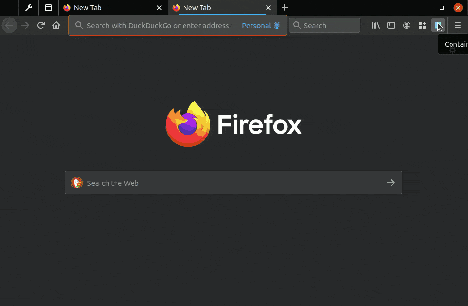
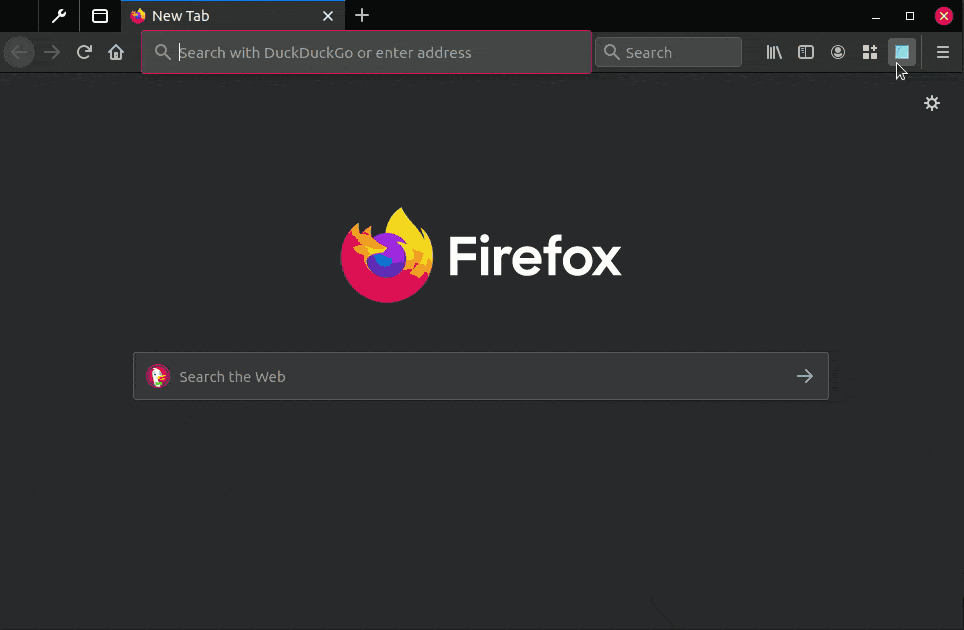
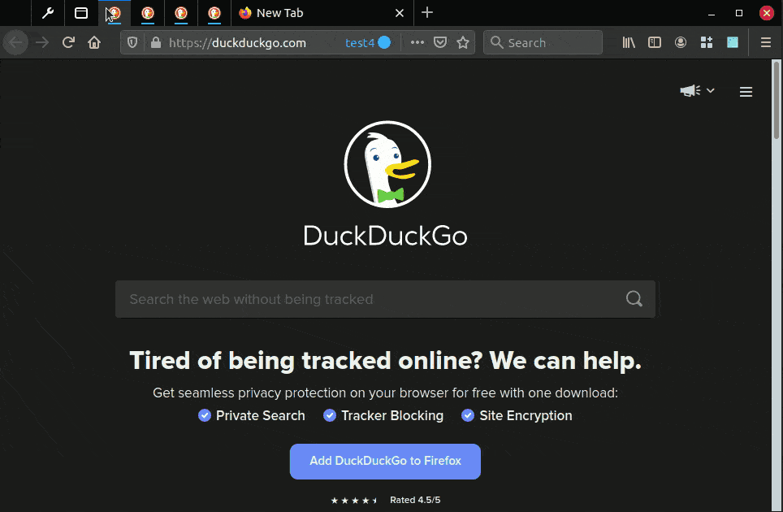

# Firefox Containers Helper

This is a small extension intended to augment the Multi-Account Containers extension in Firefox. It adds a search and URL association capability which I have found to be very useful, and also adds a bulk container deletion capability.

## Table of Contents

- [Firefox Containers Helper](#firefox-containers-helper)
  - [Table of Contents](#table-of-contents)
  - [Who is this intended for?](#who-is-this-intended-for)
  - [Features](#features)
  - [Screengrabs](#screengrabs)
    - [Basic example (short screengrab)](#basic-example-short-screengrab)
    - [Longer example](#longer-example)
    - [Setting multiple URLs simultaneously](#setting-multiple-urls-simultaneously)
    - [Opening multiple URLs simultaneously](#opening-multiple-urls-simultaneously)
    - [Bulk deletion of containers](#bulk-deletion-of-containers)
  - [Tips](#tips)
    - [Container naming convention suggestions](#container-naming-convention-suggestions)
  - [Warnings](#warnings)
  - [Future Features](#future-features)
  - [Community](#community)
  - [Attributions](#attributions)

## Who is this intended for?

If you're like me and you care deeply about your web browsing privacy, you may be creating a large amount of containers for your browsing, even multiple containers for the same sites.

If this is you, and if you've also struggled to scroll through your long list of containers without reprieve, then this extension is for you. It will enable you to quickly filter all of your containers and open a new one quickly, or do other things (continue reading).

## Features

* **Container search capability** - filters your containers as you type.
  * Press `enter` to open the first result in the list (or the only result, if just one result remains).
  * Simultaneously press `ctrl` and either `click` or `enter` to open the container in a pinned state.
  * Combine above shortcuts with `shift` to open all filtered containers at once.
* **Stay open mode** - If you want, you can check this box to keep the extension open while you click on different results (to open many containers) for your search. This mode feels very powerful to use.
* **Deletion mode** - When checked, you can click on a container to delete it. This method of deletion is a bit quicker than the multi-account containers extension. You will be prompted for deletion. **Caution: This can delete all of your containers.**
  * Similar to above, press `shift` to bulk-delete containers returned by a query.
* **Set a Default URL for containers** - Any time you use this extension to open a tab, you can configure the tab to open a specific URL by default.
  * The URL settings are stored as part of the extension itself, and are independent of the Multi-Account Containers addon. It will not affect any existing settings.
  * Similar to above, press `shift` to bulk-set-default URLs for the current query.
* **Keyboard shortcut** to open the popup window is `alt+shift+D`. It will immediately focus the search box, so you can quickly filter for a container, press enter, and go.

## Screengrabs

This section contains some recordings and walkthroughs of use cases for this extension. Hopefully, it helps clarify ways to leverage this extension as best as possible for readers.

If any of this is confusing, remember the basics:

* Press `shift` and click/enter to act on ALL results (bulk open tab/delete container/set URL action)
* Press `ctrl` and click/enter to open as pinned tabs

### Basic example (short screengrab)

In this first screengrab example, a search is done for the `personal` container, and then a click on it to open a `Personal` tab.

This is the most basic usage of the extension. Start by using the extension this way, and then move on to more power-user-friendly methods, as shown next.

After that, the next search is performed for `work`, and since it's the only result that comes up, the `enter` key can be pressed to immediately open that result. Additionally, since the `ctrl` key was held down, the `Work` tab is opened as a pinned tab. *No URLs are associated with these containers yet - keep reading to see examples.*




In summary:

* Search for a container and click the result to open a tab.
* If only one result is returned by a search, `enter` can be pressed to open that container.
  * *Note: `Enter` actually just opens the first item in the list, so this will work for many results too*
* Pressing `ctrl` while clicking on a container (or pressing `enter`) will open the result(s) as pinned.

### Longer example

In this screengrab, the first actions taken are:

* Quickly opening a few tabs by simply clicking around, while the `Stay Open` option is checked (if unchecked, the extension popup disappears.)
* Setting the default URL for a few tabs by checking the `Set Default URL` checkbox, and clicking on one tab at a time to set the URL of each tab.
* Demonstrating opening these tabs with their default URLs


### Setting multiple URLs simultaneously

In this screengrab, a query of `test` is performed, and a default URL of `https://duckduckgo.com` is set for all 4 results.

Then, all 4 results are opened simultaneously by pressing `Shift+Enter`.



### Opening multiple URLs simultaneously

In this screengrab, a query of `duckduckgo` is performed, and since multiple containers have `duckduckgo` contained within their default URL setting, pressing `ctrl+shift+enter` opens all 4 results at each of their own set default URL as pinned tabs.


### Bulk deletion of containers

In this screengrab, a query of `test` is performed. The `Delete Mode` is then checked by the user before pressing enter or any other inputs. This mode causes any click or enter keystroke to request deletion of the container (will prompt users before deletion). Next, the user presses `shift+enter`, which triggers bulk deletion of all resulting containers (after being prompted).



## Tips

*Make sure to read all of the features before perusing the tips to get the most out of the extension.*

### Container naming convention suggestions

It may be worth considering using certain naming conventions for your containers, such as:

```
finance-bankA
finance-bankB
email-gmail
email-protonmail
email-tutanota
dev-github-personal
dev-github-work
dev-gitlab-personal
dev-gitlab-work
social-reddit-personal
social-reddit-professional
social-reddit-work
chat-discord-personal
chat-discord-work
chat-slack-work
chat-slack-personal
media-streaming-netflix
media-streaming-plex
media-streaming-hulu
media-streaming-spotify
google-personal
google-work
duckduckgo-ddg
```

Then, you can filter on your containers easily and perform bulk actions.

## Warnings

This container management extension is dangerously powerful. If you're not careful, you can delete all of your containers by turning on "Delete Mode", pressing `shift+enter`, and pressing "OK" to the prompt. At this time, the extension doesn't support undoing operations or rolling back commands. You've been warned!

## Future Features

* **A proper icon** - I didn't want to deal with licensing issues, so I just made a generic icon for this extension. I'm not a graphic designer. I might get around to it some time in the future, but contributions are welcome.
* **Saved searches** - Saving the results and possibly binding to a keystroke might be useful in the future.
* **Favorite/Tagged containers** - Adding a "star" capability to certain tabs so that you can filter them easier. For now, a workaround is using the naming conventions suggested in the [tips](#tips) section.
* **Bulk actions** - Renaming containers from search results according to regular expressions might be useful.
* **Metrics** - Track simple interaction data (locally only, privacy is important) so you can look back on your interactions with containers.

## Community

If you have suggestions, please feel free to voice them on GitLab. Thank you for using my extension and reading this far!

## Attributions

This software uses Bootstrap. See the license [here](https://github.com/twbs/bootstrap/blob/main/LICENSE).
